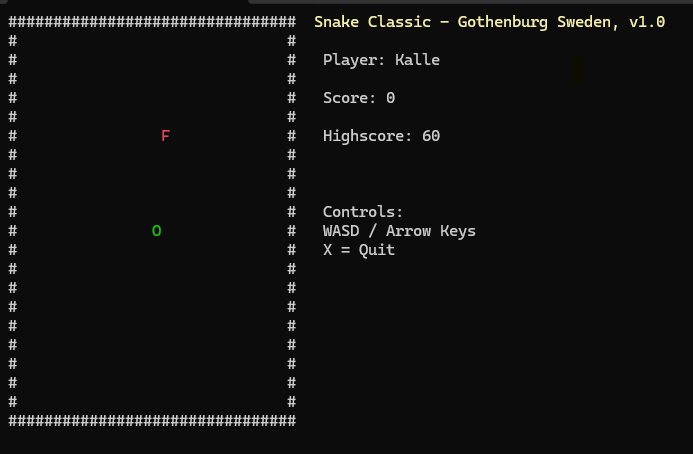
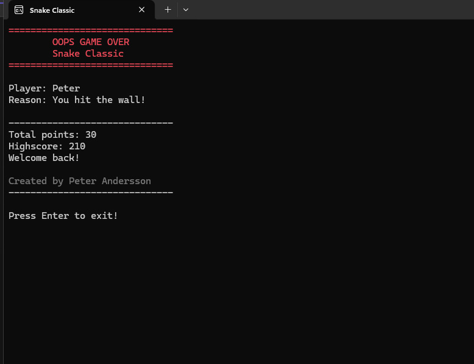

# Snake Classic C++

Retro-inspired console snake game written in modern C++.

## Features

- Retro terminal graphics
- Player profiles
- Local highscore system
- Sound effects
- Increasing difficulty
- WASD and Arrow Key controls
- DOS-inspired UI

## Screenshots

### Start Screen

### Gameplay

### Game Over

## About

Personal indie/hobby portfolio project built in modern C++.

## Status

Version 1.0
